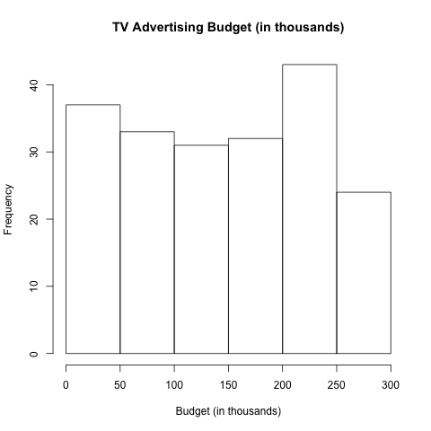
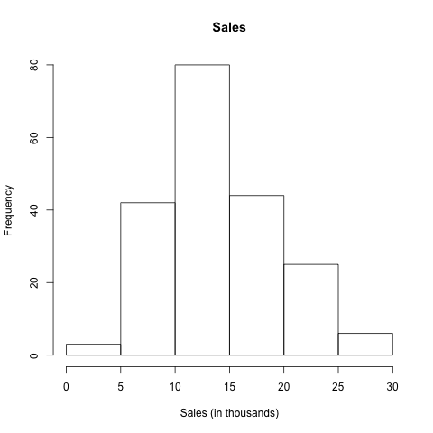

```{r setup, include=FALSE}
knitr::opts_chunk$set(echo = FALSE)
```

# Abstract
some text here

# Introduction
some text here

# Data
some text here about the summary table
```{r, results = 'asis'}
read.table("../data/eda-output.txt")
```

some text about the histograms:



# Methodology
some text here

# Results
some text here about the regression
```{r, results = 'asis'}
load("../data/regression.Rdata")
rse = round(summary_lm$sigma, 2)
r_2 = round(summary_lm$r.squared, 2)
f = round(summary_lm$fstatistic[1], 2)
Quantity = c('Residual standard error', 'R^2', 'F-statistic')
Value = rbind(rse, r_2, f)
table = data.frame(cbind(Quantity, Value))
row.names(table) = NULL

```

some text about the quantities of the regression
```{r, results = 'asis'}
summary_lm$
```

some text about the scatterplot:


# Conclusions